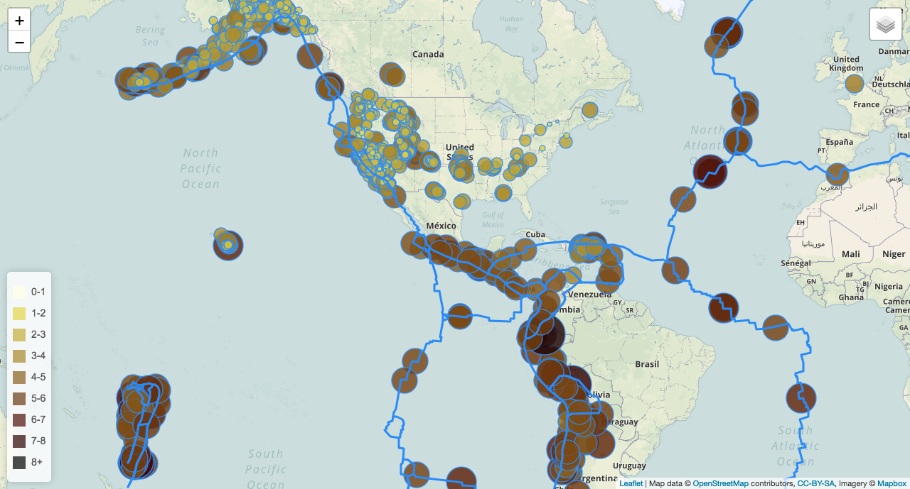

# Unit 17 | Assignment - Visualizing Data with Leaflet

## Background

Welcome to the United States Geological Survey, or USGS for short! The USGS is responsible for providing scientific data about natural hazards, the health of our ecosystems and environment; and the impacts of climate and land-use change. Their scientists develop new methods and tools to supply timely, relevant, and useful information about the Earth and its processes. As a new hire, you will be helping them out with an exciting new project!

The USGS is interested in building a new set of tools that will allow them visualize their earthquake data. They collect a massive amount of data from all over the world each day, but they lack a meaningful way of displaying it. Their hope is that being able to visualize their data will allow them to better educate the public and other government organizations (and hopefully secure more funding..) on issues facing our planet.

## Earthquake Visualization

1. **Data Sets**

   Earthquake Dataset
   https://earthquake.usgs.gov/earthquakes/feed/v1.0/summary/all_month.geojson

   Tectonic Plate Dataset
   https://raw.githubusercontent.com/fraxen/tectonicplates/master/GeoJSON/PB2002_boundaries.json

2. **Importing & Visualizing the Data**

   Create a map using Leaflet that plots all of the earthquakes from your data set based on their longitude and latitude.

   * Adding data markers that reflect the magnitude of the earthquake in their size and color

   * Includes popups that provide additional information about the earthquake when a marker is clicked

   * Has a legend that will provide context for your map data

   * Has different base maps to choose from as well as separate out our two different data sets into overlays that can be        turned on and off independently
